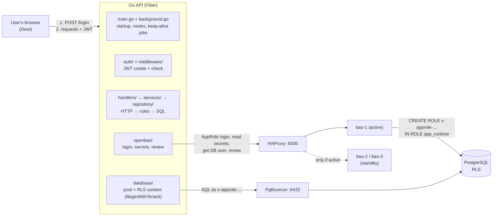
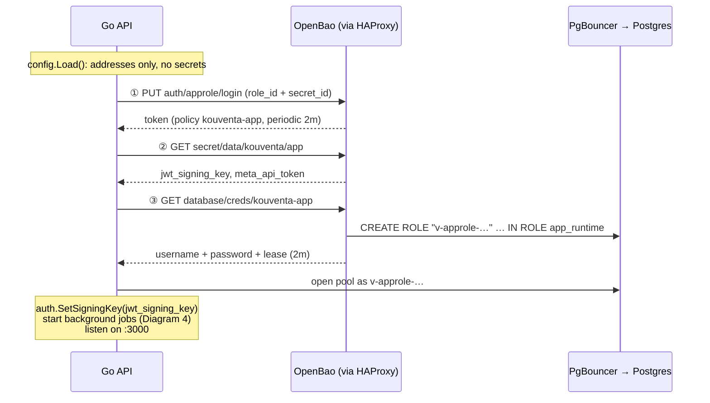
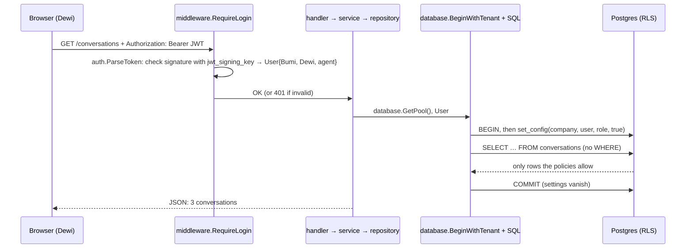
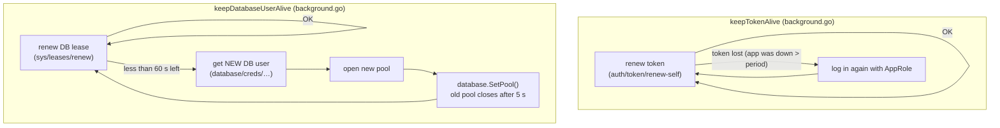

# How the Go API uses OpenBao: diagrams + talking points

Reference for the presentation. The diagrams are Mermaid: they render in Notion (code block → language "Mermaid") and on GitHub.

---

## Diagram 1: the big picture (who talks to whom)

## Diagram 2: startup (the order in `main.go`)

## Diagram 3: one request (OpenBao is NOT called)

## Diagram 4: background loops (keep everything alive)

---

## Talking points

*About 6–8 minutes. Bold = the sentence to say. Indented = details if asked or time allows.*

### 1. The goal

- **"The API starts with no secrets on disk except one: its AppRole login. Everything else (the JWT key, API tokens, the Firebase key, even the database password) comes from OpenBao at startup."**
- Before: all of that sat in a `.env` file on each server.
- The one remaining secret, the `secret_id`, is called "secret zero". It can't be removed, only limited (expiry, IP binding, single use, delivered by the pipeline).

### 2. The library

- **"We use the official OpenBao Go client, `github.com/openbao/openbao/api/v2`, plus its AppRole helper. The same code works against HashiCorp Vault. We tested that in M4."**
- OpenBao only speaks HTTP. The CLI, the web UI and our Go code send the same requests. Any CLI command can show its HTTP call with `-output-curl-string`.
- All OpenBao code lives in one package, `openbao/` (one file, one small function per call). Only `main.go` and `background.go` call it; handlers, services and repositories never import OpenBao.

### 3. Six calls make it work

**"The whole integration is five calls."**

| # | Call | When |
|---|---|---|
| ① | Log in with AppRole → token | Startup |
| ② | Read KV secrets (`secret/data/kouventa/app`) | Startup |
| ③ | Get a temporary DB user (`database/creds/kouventa-app`) | Startup + every rotation |
| ④ | Renew the token and the DB lease | Every 30 s (`background.go`) |
| ⑤ | Ask which node is active | `/status` only |

- After ①, the library attaches the token to every request automatically (`X-Vault-Token` header).
- OpenBao checks each call against the policy: the API can read `kouventa/*` but gets **403** on `otherproduct/*` and on `kouventa/admin/*`.

### 4. Startup order and "fail fast"

- **"If OpenBao is unreachable or a secret is missing, the API refuses to start. Better than running with missing secrets."**
- Order (`main.go`, STEP 1–7): settings → login → secrets → DB user → pool → background jobs → routes + listen. (Diagram 2.)
- Each step calls `log.Fatal` on error, so a broken setup stops immediately with a clear message. `/status` never shows secret values.

### 5. Two identities: the app and the user

- **"There are two different 'who's. OpenBao and the temporary DB user prove *which program* is asking. The JWT proves *which person* is asking."**
- At login the API **signs a JWT** (company, user, role, 1-hour expiry) with `jwt_signing_key`, a random key created by `configure.sh` and **stored in OpenBao**. OpenBao doesn't create JWTs; it protects the key.
- Every request: `middleware.RequireLogin` checks the signature (`auth.ParseToken`). A JWT edited to say another company fails → 401.
- Why the key matters: with the key in a `.env`, anyone who copies the file can forge a login for any user of any company.

### 6. A normal request never touches OpenBao

- **"During a request, OpenBao isn't called at all. It supplied the DB user and the JWT key at startup; requests just use them."** (Diagram 3.)
- The handler takes the `User` from the verified JWT and passes it down: handler → service → repository. The repository calls `database.BeginWithTenant`, which sets company/user/role **inside a transaction** (`set_config(…, true)`). Postgres RLS filters the rows; the SQL has no `WHERE company_id`.
- Performance: no extra network hop to OpenBao per request.

### 7. Dynamic database users and the pool swap

- **"The API doesn't have a database password. It asks OpenBao for a temporary Postgres user, which OpenBao creates on the spot and deletes when it expires."**
- The user is created `IN ROLE app_runtime`: it gets the app's permissions and RLS applies to it, because it doesn't own the tables.
- Before the user expires, the API gets a **new** one, opens a new pool and swaps it in with `database.SetPool` (a mutex makes the swap safe). The old pool closes 5 s later, after its in-flight queries. Requests always call `database.GetPool()`, so they never notice. (Diagram 4.)
- PgBouncer finds these new users through `auth_query`. A fixed user list couldn't know them.
- Username shows who asked: `v-approle-kouventa-…` = the API; `v-root-…` = an admin with the root token.

### 8. Renewal and HA

- **"Leases and tokens expire on purpose. Two background jobs in `background.go` renew them every 30 seconds; when they can't be renewed any more, they get fresh ones."**
- Token: **periodic**, renewed forever while the API runs; it only logs in again if the token was lost. DB user: renew until max TTL, then rotate.
- **Lesson we found by testing:** a DB user is tied to the token that requested it. When that token expires, OpenBao revokes the DB user too. With a max-TTL token, every re-login cut off the API's DB user, so we switched to a periodic token.
- Lab TTLs are minutes so we can watch it. Production would be hours.
- **"The API talks to one address, the load balancer. It doesn't know there are three nodes."** When the active node dies, HAProxy switches to the new leader in seconds. Tokens and leases survive because they're replicated. Our jobs just retry on the next 30-second check.
- *Tested (rewritten API, 2026-10-07):* 150/150 requests succeeded across 5 DB user rotations, then 75/75 while the active node was killed (bao-3 → bao-2 took over).

### 9. What changes for production

| Lab | Production |
|---|---|
| `secret_id` in a file, valid 24h, reusable | Delivered by the deploy pipeline, **response-wrapped**, single-use, bound to the app servers' IPs |
| Periodic token, 2-minute period | Same, longer period (e.g. 1h); `secret_id` needed only at startup |
| TTLs in minutes | Hours (e.g. 1h / 24h) |
| HTTP | TLS everywhere |

- **"Tokens renew automatically; the `secret_id` doesn't. Either the pipeline delivers fresh ones, or the app uses a periodic token so it only needs the `secret_id` at startup."**

### 10. What the team would actually change in a service

1. Add the OpenBao package (or copy `api/openbao/openbao.go`).
2. At startup: log in, read the secrets, replace `os.Getenv("X")` with values from OpenBao.
3. DB: first read a **static role** password from OpenBao (no other change). Later, dynamic users + pool swap.
4. For RLS: in the repository, start each transaction with `BeginWithTenant`, using the user from the verified JWT.

---

## Likely questions

| Question | Answer |
|---|---|
| What if OpenBao is down? | Running apps keep working until their token/DB lease expires (lab minutes, production hours). New starts fail. That's why it runs as an HA cluster |
| Does every request hit OpenBao? | No. Only startup, renewals (every 30 s) and rotations |
| Can the API read other products' secrets? | No: the policy allows only `kouventa/*`. We showed the 403 |
| Is a JWT created per request? | No, once at login. Requests only verify it |
| Does it work with Vault? | Yes, same library and API. Tested in M4 |
| Why not keep one fixed DB password in OpenBao? | That's step 1 (static role, rotated by OpenBao). Dynamic users add one user per app instance, short-lived, and an audit trail |
| What does the user see during rotation or failover? | Nothing. Tested with continuous requests |
